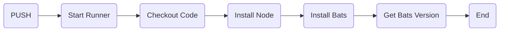

---
# try also 'default' to start simple
theme: purplin
# random image from a curated Unsplash collection by Anthony
# like them? see https://unsplash.com/collections/94734566/slidev
background: https://source.unsplash.com/collection/94734566/1920x1080
# https://sli.dev/custom/highlighters.html
highlighter: shiki
download: true
# some information about the slides, markdown enabled
info: |
  ## GitHub Actions Introduction
layout: intro
colorSchema: 'dark'
---

# Ready Set Action

Democratizing CI on GitHub

<BarBottom
  title="Reach out!"
  :social="[
    { type: 'gh', username: 'jandedobbeleer' },
    { type: 'tw', username: 'jandedobbeleer' },
    { type: 'lk', username: 'jandedobbeleer' },
    { type: 'wb', username: 'ohmyposh.dev' }
  ]"
/>

---

## Agenda

What are we going to talk about?

<v-clicks>

- <mdi-emoticon-outline style="display: inline-block"/> **Developer Friendly** - key differences with current CI systems
- <mdi-account-question-outline style="display: inline-block"/> **Definition** - how do we describe GitHub Actions?
- <mdi-cog-outline style="display: inline-block"/> **In practice** - how does it work?
- <mdi-shopping-outline style="display: inline-block"/> **Plug and Play** - marketplace
- <mdi-timer-outline style="display: inline-block"/> **Configuration** - repository settings
- <mdi-rocket-launch-outline style="display: inline-block"/> **Demo** - Practical side of things

</v-clicks>

<br>
<br>

<v-click>

Find out everything at [GitHub](https://github.com/features/actions)

</v-click>

---

## History

Throughout the years, CI has gone through multiple transitions.


<v-clicks>

- <mdi-baby-bottle-outline style="display: inline-block"/> Originated as a vision in 1991 ([Grady Booch](https://twitter.com/Grady_Booch))
- <mdi-wrench-outline style="display: inline-block"/> From custom implementations to out of the box tools (Jenkins/Bamboo)
- <mdi-cloud-sync-outline style="display: inline-block"/> From on premise tools to cloud enabled CI (Travis, Appveyor, ...)
- <mdi-state-machine style="display: inline-block"/> From cloud enabled CI to embedded in a single stack (Gitlab)
- <mdi-account-group-outline style="display: inline-block"/> From standalone custom scripts to a democratized process (Github)

</v-clicks>

---
layout: image-right
image: https://media.giphy.com/media/KGSxFwJJHQPsKzzFba/giphy.gif
---

## Definition

GitHub Actions makes it easy to automate all your software workflows, now with world-class CI/CD.

Build, test, and deploy your code right from GitHub. Make code reviews, branch management, and issue triaging work the way you want.

---

## In practice

<br>
<v-clicks>

- Logic is embedded in source control
  - **.github/workflows** contains the actual logic
  - Every workflow is a YAML based file containing steps
- A workflow contains the following items:
  - trigger: when should it run?
  - job: bundle steps in 1 context
  - steps: individual build steps
- You can share items for commonly used "blocks"
  - Share a specific workflow within organisations (e.g. our backend service build logic template)
  - Share steps with people inside your organisation and the rest of the world (e.g run [Resharper validation](https://github.com/glassechidna/resharper-action))

</v-clicks>

---

## Workflow file

Contains the actual logic.

```yaml
name: learn-github-actions
on: [push]
jobs:
  check-bats-version:
    runs-on: ubuntu-latest
    steps:
      - uses: actions/checkout@v2
      - uses: actions/setup-node@v1
      - run: npm install -g bats
      - run: bats -v
```

<div style="padding-top:50px"/>
<v-click>

</v-click>


---

## Triggers

<br>

```yaml
# Triggers the workflow on push or pull request events
on: [push, pull_request]
```

<br>

<v-clicks>

- By default ANY event triggers a workflow, unless specified otherwise
- 3 types of triggers:
  - Schedule (cron job)
  - Manual event (via API or manual)
  - Webhooks (events during GitHub)
- Can be a single or multiple events

</v-clicks>

<br>

[All triggers](https://docs.github.com/en/actions/reference/events-that-trigger-workflows)

---

## Jobs


<v-clicks>

- Run in parallel by default
- Can be run in sequence by specifying a need
- You can run things in parallel inside a job by defining a matrix

</v-clicks>

---

## Jobs/Sample

```yaml
jobs:
  build:
    runs-on: ubuntu-latest
    strategy:
      matrix:
        node: [6, 8, 10]
    steps:
      - uses: actions/setup-node@v1
        with:
          node-version: ${{ matrix.node }}
      - run: echo $(node --version)
  party:
    runs-on: ubuntu-latest
    steps:
      - run: echo "Building new release 🎉"
  release:
    needs: build
    runs-on: ubuntu-latest
    steps:
      - run: echo "New release 🎉"
```

---

## Runners

<br>

<v-clicks>

- Every job/workflow/matrix executes in it's own runner (like container/VM)
- Hosted GitHub runner come with specific tools installed ([list](https://docs.github.com/en/actions/using-github-hosted-runners/about-github-hosted-runners))
- You can host your own runner (think specific OS/runtime support)

</v-clicks>

---

## Types of Actions

<br>

<v-clicks>

- Docker container actions
  - creates a more consistent and reliable unit of work
  - allows you to use specific versions of an operating system, dependencies, tools, and code
- JavaScript actions
  - run directly on a runner machine
  - simplifies the action code and executes faster than a Docker container action
- Composite run steps actions
  - combine multiple workflow run steps within one action

</v-clicks>

---

## Plug and play

<br>

<v-clicks>

- [Marketplace](https://github.com/marketplace?type=actions) provides A LOT of out of the box action steps
  - No need to reinvent the wheel
  - You can [create your own](https://docs.github.com/en/actions/creating-actions)!
- Organisations can share [workflow templates](https://docs.github.com/en/actions/learn-github-actions/sharing-workflows-with-your-organization)
  - Maximizes reusability (e.g. we have x dotnet microservice repo's)
  - Reduces errors

</v-clicks>

---

# Repository settings

<br>

<v-clicks>

- Jobs can be set as required to pass before merging a PR
- ⚠️ A job with a matrix shows the individual matrix steps ([workaround](https://github.community/t/status-check-for-a-matrix-jobs/127354/7))
- ⚠️ A required job that does not run will not allow a merge ([workaround](https://github.com/fkirc/skip-duplicate-actions))
- ⚠️ New builds do not cancel previously ongoing runs ([workaround](https://github.com/fkirc/skip-duplicate-actions))

</v-clicks>

---
layout: center
---

# Demo

---
